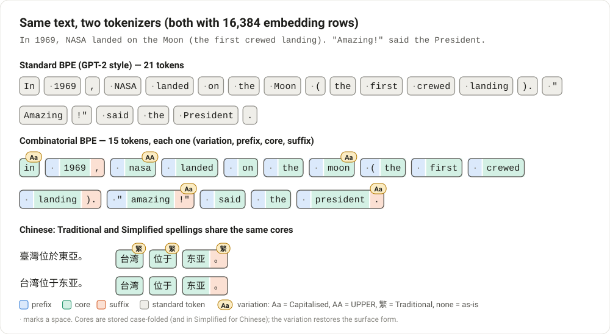
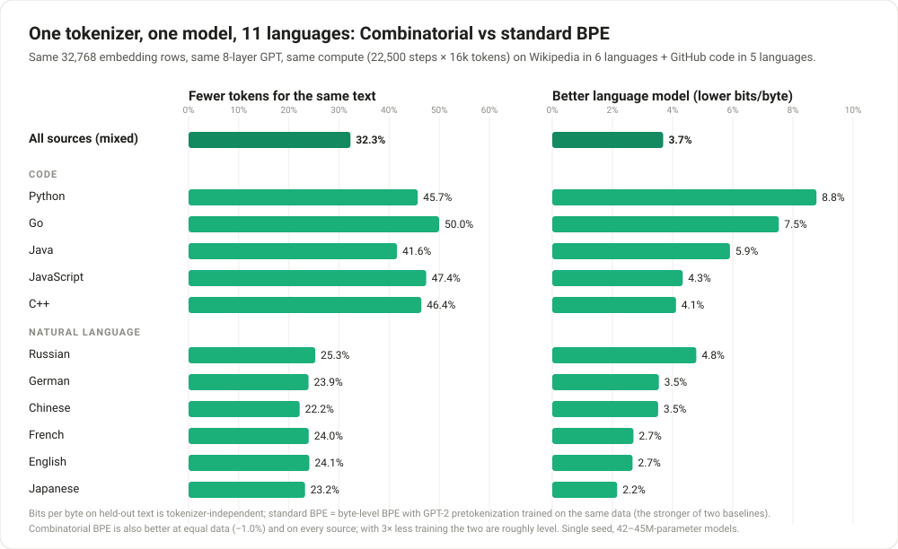
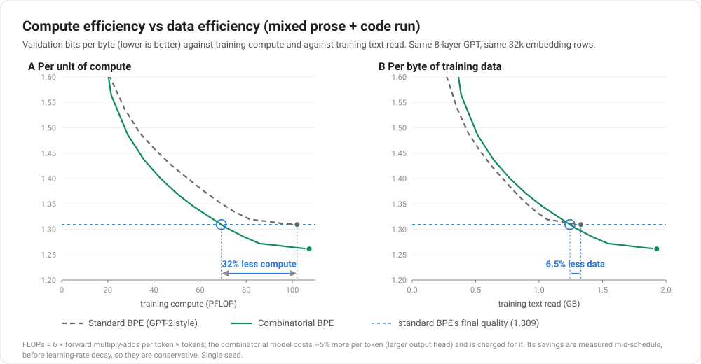
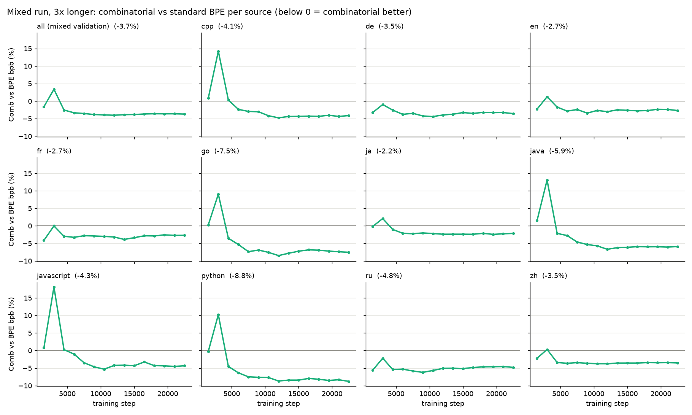
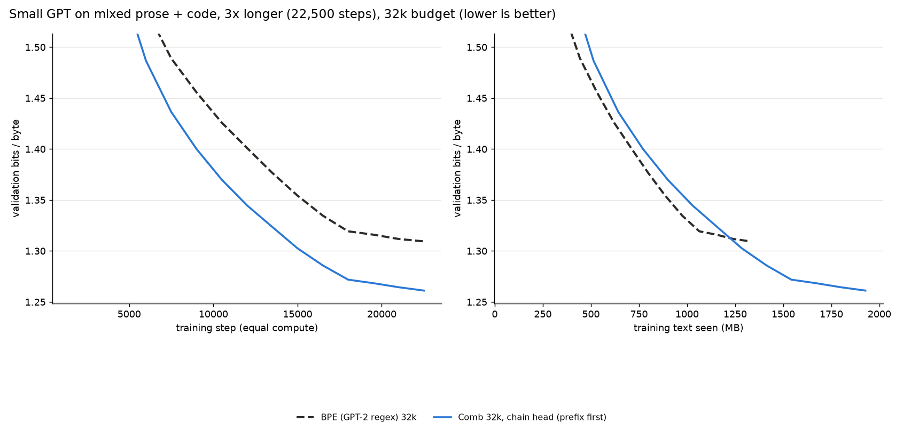
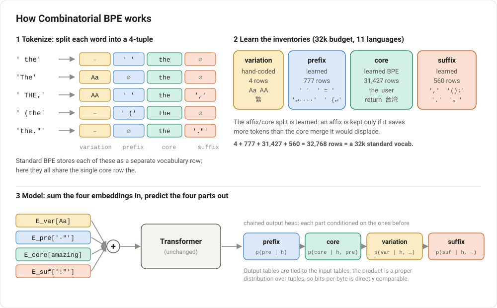
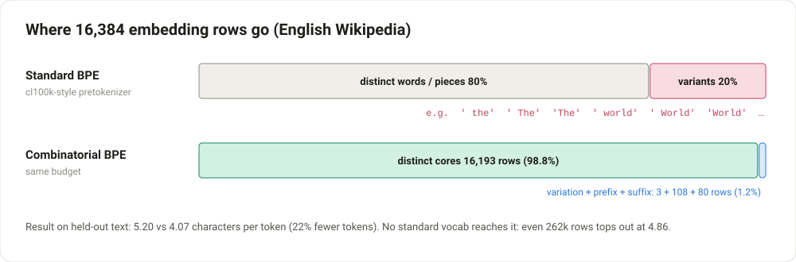
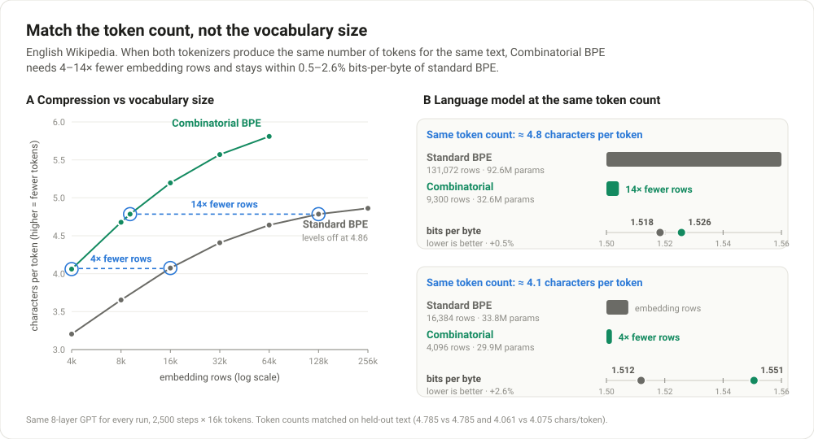

# Combinatorial BPE

Standard BPE vocabularies spend many rows on surface variants of the same word: `data`, `Data`,
` data`, ` Data`, `DATA` … each with its own embedding. **About 20% of a 32k vocabulary is such
variants.** Combinatorial BPE instead makes every token a 4-tuple:

```
token = (variation, prefix, core, suffix)       ' "Amazing!"'  ->  (Capitalised, ' "', 'amazing', '!"')
```

The model embeds a token as the sum of four embeddings. The core vocabulary stores each word
once, and small learned tables supply the case, the leading whitespace/punctuation and the
trailing punctuation. Only the case rules are hand-coded; everything else is learned from data.



## Main result: one tokenizer and one model for 11 languages

A single 32k tokenizer and a single small GPT (8 layers, 42–45M parameters) trained on a mix of
Wikipedia in 6 languages and GitHub code in 5 languages. Both tokenizers get the same number
of embedding rows, and both models get the same compute (22,500 steps × 16k tokens):



- **32% fewer tokens** for the same text overall: 22–25% on natural language, 42–50% on code.
- **3.7% lower bits-per-byte** overall (1.261 vs 1.309), and **better on every one of the 11
  sources**. The biggest gains are on code (Python −8.8%, Go −7.5%, Java −5.9%).
- **It is both more compute-efficient and more data-efficient.** It reaches the baseline's final
  quality with **32% less training compute** and **6.5% less training data** (conservative: that
  point is before its learning-rate decay). At the baseline's full 1,330M bytes it is 1.0% better.
- **The advantage needs enough training.** With a third of the training (7,500 steps) the two
  models are roughly level (−0.6%). The per-source curves show the pattern: behind very early,
  ahead from step ~4,500 on everywhere.



<details>
<summary>Per-source numbers and learning curves</summary>

| source | fewer tokens | standard BPE (bpb) | Combinatorial BPE (bpb) | Δ bpb |
|---|---:|---:|---:|---:|
| **all (mixed)** | **32%** | 1.309 | **1.261** | **−3.7%** |
| Python | 46% | 0.983 | **0.896** | −8.8% |
| Go | 50% | 0.931 | **0.861** | −7.5% |
| Java | 42% | 0.766 | **0.721** | −5.9% |
| Russian | 25% | 0.892 | **0.850** | −4.8% |
| JavaScript | 47% | 0.998 | **0.955** | −4.3% |
| C++ | 46% | 1.029 | **0.987** | −4.1% |
| German | 24% | 1.572 | **1.516** | −3.5% |
| Chinese | 22% | 1.861 | **1.795** | −3.5% |
| English | 24% | 1.512 | **1.472** | −2.7% |
| French | 24% | 1.492 | **1.451** | −2.7% |
| Japanese | 23% | 1.338 | **1.309** | −2.2% |




</details>

## How it works



- **Multi-piece words.** A word that needs several core pieces becomes several tuples. The prefix
  rides on the first tuple and the suffix on the last. Encoding is **lossless** for any input
  (UTF-8 byte fallback).
- **Equal budget.** `|variation| + |prefix| + |core| + |suffix|` equals the standard vocab size,
  so both sides always get the same number of embedding rows.
- **Learned budget split.** Each affix saves about `freq(affix)` tokens and each BPE merge about
  `count(merge)`. Training keeps the best *N* of both. Affixes get ~1% of the rows on prose and
  ~12% on code.
- **camelCase splitting** (`split_camel=True`). `getUserName` → `get|User|Name` before core BPE,
  so every piece has a clean case pattern.
- **Traditional/Simplified Chinese** (`fold_han=True`). Cores are stored in Simplified; a
  Traditional character is folded only when OpenCC's default mapping gives it back exactly.
  "Traditional" means "OpenCC's default mapping", so words mixing a dual-use character with a
  converted one (台灣 = 台 + 灣) fall back to per-character variations: still lossless, slightly
  less efficient (~0.3% of Chinese characters).
- **Model.** Sum the four embeddings in; predict prefix → core → variation → suffix out, each
  conditioned on the parts before it. It's a proper distribution, so bits-per-byte is directly
  comparable to standard BPE.



## Quickstart

```bash
pip install -e .            # runtime dependency: regex
```

```python
from cbpe import load, CombinatorialBPE, VARIATIONS

tok = load("pretrained/mix_32768_comb.json")          # prose (6 languages) + code (5 languages)
text = 'In 1969, NASA landed on the Moon. "Amazing!" said the President.'
ids = tok.encode(text)                                  # list of (variation, prefix, core, suffix)
assert tok.decode(ids) == text
for v, p, c, s in ids:
    print(VARIATIONS[v], repr(tok.prefixes[p]), tok.core.vocab[c], repr(tok.suffixes[s]))

# train your own (split_camel for code, fold_han for Chinese)
tok = CombinatorialBPE.train(open("corpus.txt", encoding="utf-8").read(), vocab_size=32768,
                             split_camel=True, fold_han=True)
tok.save("my_tokenizer.json")
```

| file in [`pretrained/`](pretrained) | trained on | budget |
|---|---|---|
| `mix_32768_comb.json` | 6 languages + 5 programming languages (camelCase + Traditional) | 32k |
| `mix_32768_bpe_gpt2.json` | same data, standard BPE baseline | 32k |
| `multi_32768_comb.json` | en, de, fr, ru, tr, hi Wikipedia | 32k |
| `wiki_en_16384_comb.json` / `wiki_en_16384_bpe_gpt2.json` | English Wikipedia (Comb / baseline) | 16k |
| `wiki_zh_16384_comb_han.json` | Chinese Wikipedia (Traditional variation) | 16k |

## Other results

Everything is in [results/REPORT.md](results/REPORT.md). The highlights:

**Compression, single-domain tokenizers at 16k** (more characters per token than the better of
two standard BPE baselines at the same budget): English +28%, German +31%, French +26%,
Russian +36%, Turkish +33%, Hindi +21%, Japanese +24%, Chinese +18% (+24% with the Traditional
variation), code +61% to +83%. On code a 16k Combinatorial BPE needs 32–40% fewer tokens than
GPT-4's 100k-entry `cl100k_base`. Standard BPE cannot catch up by growing: on English it levels
off at ~4.86 chars/token even with 262k entries, where Combinatorial BPE reaches 5.20 with 16k.

**Language modelling, single domain** (same GPT; bits-per-byte vs the best standard BPE):

| setting | Δ bpb |
|---|---:|
| English, 7,500 steps | **−2.4%** (−1.0% at equal data) |
| JavaScript, 7,500 steps | **−7.8%** (+2.7% at equal data) |
| English / JavaScript / Chinese, 2,500 steps | +0.8% / +4.5% / +3.2% (still behind) |
| English, equal token count: 9.3k Comb vs 128k standard | +0.5% with 14× fewer embedding rows |



## Limitations and prior art

- **Small scale.** 30–45M-parameter models (93M for the 128k-vocab baseline), at most 369M
  training tokens, one seed per run. The advantage appears only after enough training; how it
  behaves at real model scale is untested. The combinatorial model's chained output head adds
  ~2.4M parameters (~6%); no parameter-matched baseline was run.
- **Equal compute vs equal data.** The headline is at equal compute (shorter sequences let the
  model read more text). At equal data, the mixed run and English still win; single-domain
  JavaScript does not.
- **Prior art.** Factoring tokens into a base form plus case and joining factors exists in
  machine translation: Marian NMT's factored vocabularies and
  [Wilken & Matusov 2019](https://arxiv.org/abs/1910.03912). Recent LM work removes the same
  duplication with inline marker tokens instead
  ([Land & Meister 2026](https://arxiv.org/abs/2608.08847)), gaining bits-per-byte without
  compression. What's new here is learned multi-character affixes, the learned budget split, and
  the language-modelling evaluation across natural and programming languages.

## Reproducing

```bash
python -m venv .venv && .venv/Scripts/pip install -r requirements-dev.txt   # + PyTorch for experiments/lm.py
python scripts/download_data.py --lm                        # Wikipedia + TinyStories
python scripts/download_data.py --langs ja zh --chars 20e6
python scripts/download_data.py --code                      # Python, Java, JS, C++, Go (split by repo)
python -m pytest
python experiments/build_mix.py                             # 32k mixed tokenizers + LM/validation text
python experiments/build_mix.py --lm_only --lm_scale 3 --lm_out mix_lm3x.txt   # needs the *_lm150 downloads
python experiments/lm.py results/tokenizers/mix_32768_bpe_gpt2.json --train_text data/mix_lm3x.txt \
    --val_text data/mix.test.txt --extra_val data/val_mix_*.txt --steps 22500 --eval_every 1500 --out results/lm_mix3x.json
python experiments/lm.py results/tokenizers/mix_32768_comb.json --head chain --order 1,2,0,3 [same args]
python experiments/bench_compression.py && python experiments/bench_code.py   # compression benchmarks
python experiments/report.py && python scripts/make_figures.py                # report + figures
```

The larger LM downloads use `download_data.wiki_lm(lang, 150e6, suffix="_lm150")` and
`download_data.code_lm_multi(...)`. Each 22,500-step run takes ~55 min on an RTX 3090.

<details>
<summary>Repository layout</summary>

```
cbpe/bpe.py                      char-level BPE trainer/encoder with UTF-8 byte fallback
cbpe/tokenizers.py               StandardBPE (GPT-2 / cl100k regexes) and CombinatorialBPE
cbpe/data/han_st.json            Traditional/Simplified fold tables (built from OpenCC)
pretrained/                      ready-to-use tokenizers
tests/                           round-trip, factorisation and save/load tests
scripts/download_data.py         Wikipedia, TinyStories and GitHub code (codeparrot/github-code-clean)
scripts/build_han_tables.py      OpenCC -> cbpe/data/han_st.json
scripts/make_figures.py          figures/*.svg
experiments/build_mix.py         mixed prose + code tokenizers and LM data
experiments/lm.py                small-GPT bits-per-byte comparison (factored output heads)
experiments/encode.py            streaming parallel tokenisation for lm.py
experiments/bench_compression.py compression at equal budget, 10 corpora x 5 sizes, ablations
experiments/bench_code.py        source-code compression (+ camelCase ablation, GPT-4 reference)
experiments/bench_han.py         Chinese Traditional variation
experiments/bench_iso.py         English compression up to 256k vocab (token-count matching)
experiments/report.py            results/REPORT.md and plots
```

</details>

## License

MIT, see [LICENSE](LICENSE). The Traditional/Simplified tables in `cbpe/data/han_st.json` are
derived from [OpenCC](https://github.com/BYVoid/OpenCC) (Apache-2.0), see [NOTICE](NOTICE).
