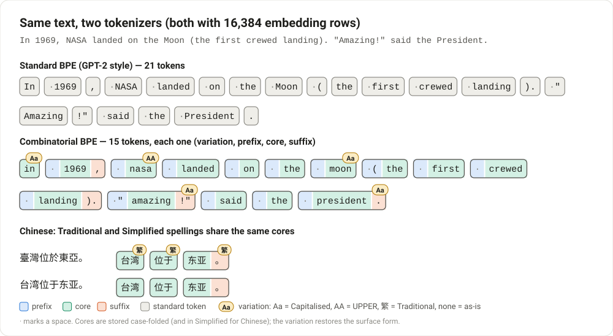
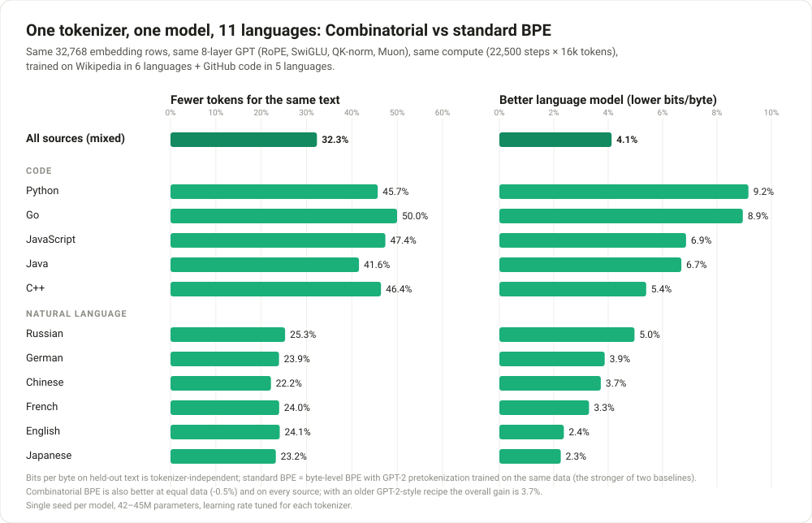
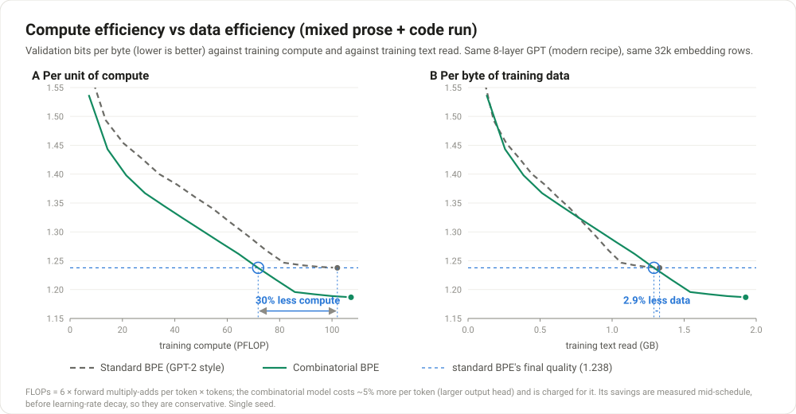
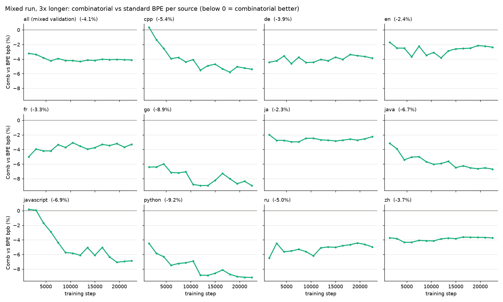
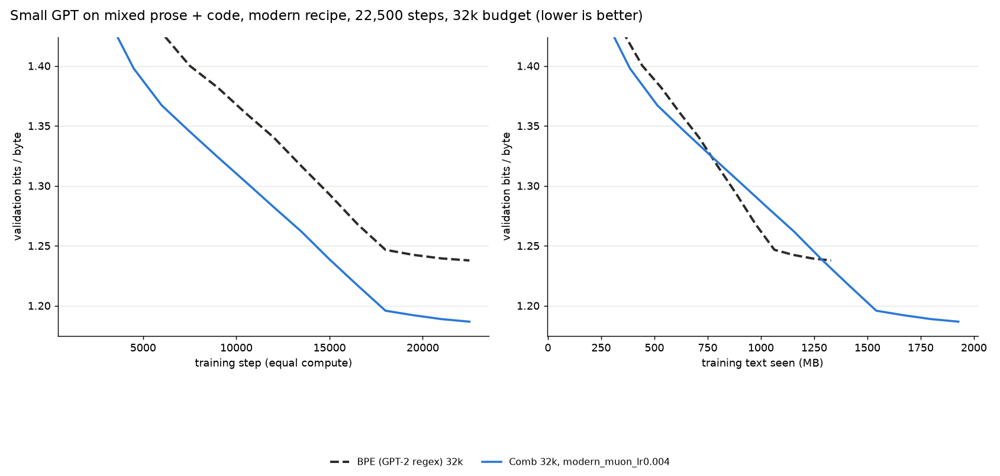
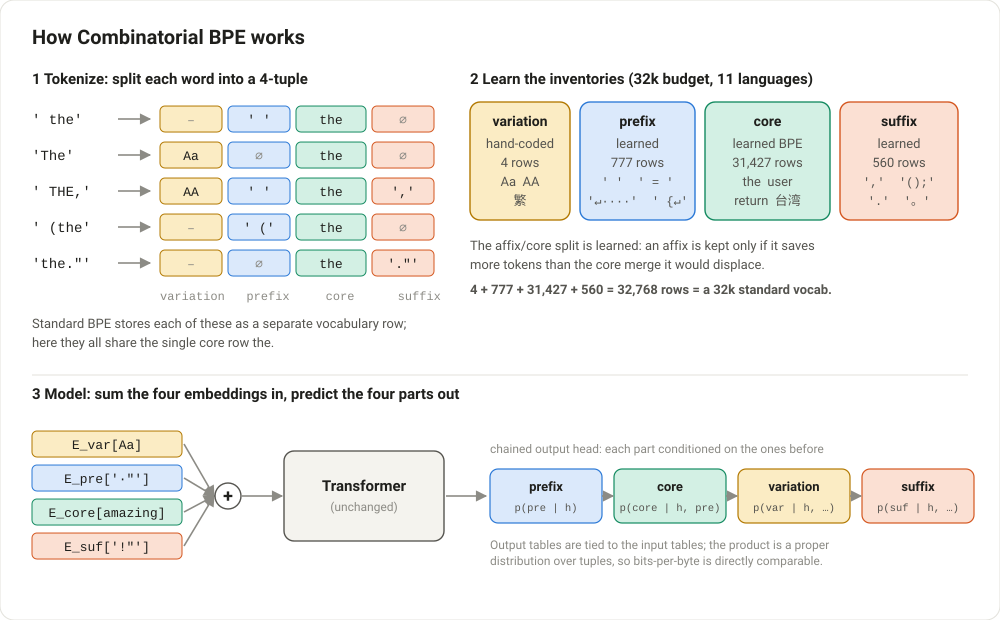
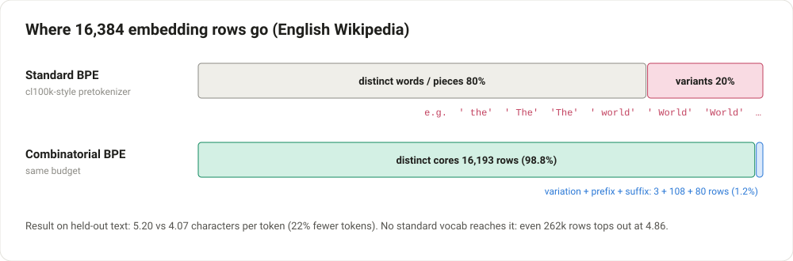
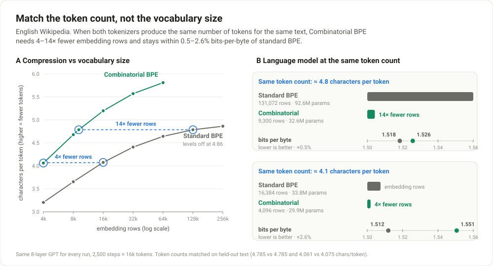

# Combinatorial BPE

Standard BPE vocabularies spend many rows on surface variants of the same word: `data`, `Data`,
` data`, ` Data`, `DATA` … each with its own embedding. **About 20% of a 32k vocabulary is such
variants.** Combinatorial BPE instead makes every token a 4-tuple:

```
token = (variation, prefix, core, suffix)       ' "Amazing!"'  ->  (Capitalised, ' "', 'amazing', '!"')
```

The model embeds a token as the sum of four embeddings. The core vocabulary stores each word
once, and small learned tables supply the case, the leading whitespace/punctuation and the
trailing punctuation. Only the case rules are hand-coded; everything else is learned from data.



## Main result: one tokenizer and one model for 11 languages

A single 32k tokenizer and a single small GPT trained on a mix of Wikipedia in 6 languages and
GitHub code in 5 languages. The GPT has 8 layers and 42–45M parameters, and uses a modern
recipe: RoPE, RMSNorm, QK-norm, SwiGLU and the Muon optimizer, with the learning rate tuned for
each tokenizer. Both tokenizers get the same number of embedding rows, and both models get the
same compute (22,500 steps × 16k tokens):



- **32% fewer tokens** for the same text overall: 22–25% on natural language, 42–50% on code.
- **4.1% lower bits-per-byte** overall (1.187 vs 1.238), and **better on every one of the 11
  sources**. The biggest gains are on code (Python −9.2%, Go −8.9%, JavaScript −6.9%).
- **More compute-efficient and slightly more data-efficient.** It reaches the baseline's final
  quality with **30% less training compute** and 2.9% less training data (conservative: that
  point is before its learning-rate decay). At the baseline's full 1,330M bytes of text it is
  0.5% better.
- **Robust to the training recipe and the learning rate.** It led from the first checkpoint on,
  at all three learning rates in the sweep (−3.1% to −3.3% after 3,000 steps). With an older
  GPT-2-style recipe (learned positions, LayerNorm, AdamW) the result is similar: −3.7% overall,
  better on all 11 sources. That recipe needs more training before the advantage shows; at a
  third of the steps the two are level.



<details>
<summary>Per-source numbers and learning curves</summary>

| source | fewer tokens | standard BPE (bpb) | Combinatorial BPE (bpb) | Δ bpb |
|---|---:|---:|---:|---:|
| **all (mixed)** | **32%** | 1.238 | **1.187** | **−4.1%** |
| Python | 46% | 0.920 | **0.835** | −9.2% |
| Go | 50% | 0.866 | **0.789** | −8.9% |
| JavaScript | 47% | 0.939 | **0.875** | −6.9% |
| Java | 42% | 0.714 | **0.666** | −6.7% |
| C++ | 46% | 0.964 | **0.912** | −5.4% |
| Russian | 25% | 0.835 | **0.794** | −5.0% |
| German | 24% | 1.482 | **1.425** | −3.9% |
| Chinese | 22% | 1.771 | **1.705** | −3.7% |
| French | 24% | 1.412 | **1.365** | −3.3% |
| English | 24% | 1.424 | **1.390** | −2.4% |
| Japanese | 23% | 1.272 | **1.243** | −2.3% |




Older GPT-2-style recipe, same data and steps: [learning curves](results/lm_mix3x.png),
[per-source gap](results/lm_mix3x_sources.png).

</details>

## How it works



- **Multi-piece words.** A word that needs several core pieces becomes several tuples. The prefix
  rides on the first tuple and the suffix on the last. Encoding is **lossless** for any input
  (UTF-8 byte fallback).
- **Equal budget.** `|variation| + |prefix| + |core| + |suffix|` equals the standard vocab size,
  so both sides always get the same number of embedding rows.
- **Learned budget split.** Each affix saves about `freq(affix)` tokens and each BPE merge about
  `count(merge)`. Training keeps the best *N* of both. Affixes get ~1% of the rows on prose and
  ~12% on code.
- **camelCase splitting** (`split_camel=True`). `getUserName` → `get|User|Name` before core BPE,
  so every piece has a clean case pattern.
- **Traditional/Simplified Chinese** (`fold_han=True`). Cores are stored in Simplified; a
  Traditional character is folded only when OpenCC's default mapping gives it back exactly.
  "Traditional" means "OpenCC's default mapping", so words mixing a dual-use character with a
  converted one (台灣 = 台 + 灣) fall back to per-character variations: still lossless, slightly
  less efficient (~0.3% of Chinese characters).
- **Model.** Sum the four embeddings in; predict prefix → core → variation → suffix out, each
  conditioned on the parts before it. It's a proper distribution, so bits-per-byte is directly
  comparable to standard BPE.



## Quickstart

```bash
pip install -e .            # runtime dependency: regex
cd native/bpe_train && cargo build --release   # optional: Rust merge loop, same results, faster training
```

```python
from cbpe import load, CombinatorialBPE, VARIATIONS

tok = load("pretrained/mix_32768_comb.json")          # prose (6 languages) + code (5 languages)
text = 'In 1969, NASA landed on the Moon. "Amazing!" said the President.'
ids = tok.encode(text)                                  # list of (variation, prefix, core, suffix)
assert tok.decode(ids) == text
for v, p, c, s in ids:
    print(VARIATIONS[v], repr(tok.prefixes[p]), tok.core.vocab[c], repr(tok.suffixes[s]))

# train your own (split_camel for code, fold_han for Chinese)
tok = CombinatorialBPE.train(open("corpus.txt", encoding="utf-8").read(), vocab_size=32768,
                             split_camel=True, fold_han=True)
tok.save("my_tokenizer.json")
```

| file in [`pretrained/`](pretrained) | trained on | budget |
|---|---|---|
| `mix_163840_comb.json` / `mix_163840_bpe_gpt2.json` | same mix, at Kimi K3's vocabulary size (Comb / baseline) | 164k |
| `mix_32768_comb.json` | 6 languages + 5 programming languages (camelCase + Traditional) | 32k |
| `mix_32768_bpe_gpt2.json` | same data, standard BPE baseline | 32k |
| `multi_32768_comb.json` | en, de, fr, ru, tr, hi Wikipedia | 32k |
| `wiki_en_16384_comb.json` / `wiki_en_16384_bpe_gpt2.json` | English Wikipedia (Comb / baseline) | 16k |
| `wiki_zh_16384_comb_han.json` | Chinese Wikipedia (Traditional variation) | 16k |

## Other results

Everything is in [results/REPORT.md](results/REPORT.md). The highlights:

**Compression, single-domain tokenizers at 16k** (more characters per token than the better of
two standard BPE baselines at the same budget): English +28%, German +31%, French +26%,
Russian +36%, Turkish +33%, Hindi +21%, Japanese +24%, Chinese +18% (+24% with the Traditional
variation), code +61% to +83%. On code a 16k Combinatorial BPE needs 32–40% fewer tokens than
GPT-4's 100k-entry `cl100k_base`. Standard BPE cannot catch up by growing: on English it levels
off at ~4.86 chars/token even with 262k entries, where Combinatorial BPE reaches 5.20 with 16k.

**Against production tokenizers** (characters per token on the same validation sets, higher is
better). The production tokenizers were trained on their own web data while ours are in-domain,
so compare our two 160k rows with each other for the like-for-like result:

| tokenizer | vocab | English | Russian | Chinese | Python | JavaScript | all 11 |
|---|---:|---:|---:|---:|---:|---:|---:|
| Kimi K3 | 164k | 4.59 | 2.49 | 1.26 | 4.00 | 3.64 | 2.66 |
| GPT-4o `o200k_base` | 200k | 4.63 | 3.35 | 1.14 | 4.01 | 3.66 | 2.75 |
| GPT-4 `cl100k_base` | 100k | 4.59 | 2.02 | 0.77 | 4.03 | 3.71 | 2.21 |
| standard BPE, ours | 164k | 4.50 | 4.07 | 1.58 | 3.53 | 3.20 | 3.06 |
| **Combinatorial BPE, ours** | **164k** | **5.77** | **5.62** | **2.13** | **6.58** | **6.17** | **4.64** |

At Kimi K3's exact budget (163,840 rows) Combinatorial BPE needs 34% fewer tokens than standard
BPE trained on the same data (+52% characters per token: +28–38% on natural languages, +86–97% on
code). The gap does not shrink at frontier vocabulary sizes.

**Language modelling, single domain** (same GPT; bits-per-byte vs the best standard BPE):

| setting | Δ bpb |
|---|---:|
| English, 7,500 steps | **−2.4%** (−1.0% at equal data) |
| JavaScript, 7,500 steps | **−7.8%** (+2.7% at equal data) |
| English / JavaScript / Chinese, 2,500 steps | +0.8% / +4.5% / +3.2% (still behind) |
| English, equal token count: 9.3k Comb vs 128k standard | +0.5% with 14× fewer embedding rows |



## Unrestricted trainer (experimental)

`native/dict_search` trains the factors **without the regex restrictions**: prefixes, cores and
suffixes can be any strings, and a from-scratch dictionary search decides what goes where (see
[docs/unrestricted_trainer_problem.md](docs/unrestricted_trainer_problem.md) and the parameter
documentation at the top of `native/dict_search/src/main.rs`). Tokens never cross whitespace
(`--hybrid`: text is cut into `\s*\S+` chunks); nothing else is language-specific.

- **Search.** Candidate rows come from a frequent-substring index (exclusive counts, so the
  substrings of a frequent word do not all claim its occurrences), are routed to the cut whose
  weakest row is most in demand, and are re-scored exactly by re-parsing. Rows are pruned by
  leave-one-out loss against an MDL price (spelling bits × productivity / paradigm multipliers),
  so a row has to pay for itself.
- **Case.** Cores keep their most frequent spelling (`iPhone`, `YouTube`); with `case_affixes`
  affixes do too, and 8 variations (as stored, Capitalised, UPPER, Traditional, lower, camelCase,
  PascalCase, Title) apply to the whole token, so `unhappy` / `Unhappy` / `UNHAPPY` and
  `getName` / `filename` share rows.
- **Scripts.** `mark_rule` keeps combining marks (Devanagari vowel signs, viramas) attached to the
  character before them.
- **Exact encoder.** A DP over (prefix, core, suffix) minimising tokens, then bits; lossless with
  byte fallback.

Recommended flags (see `experiments/bench_dictsearch.py`; data from `scripts/download_curated.py`):

```bash
CBPE_DATA=curated python experiments/bench_dictsearch.py --hybrid --vocab=131072 --tokdata=320000000 \
  --set=max_rounds:12 --set=min_freq:50 --set=first_expand_permille:4000 --set=max_packages:2000000 \
  --set=prune_step_permille:150 --set=lambda_permille:20 --set=rerank_mult:4 --set=rerank_occ:300 \
  --set=refactor:1 --set=price_permille:100 --set=prod_k:50 --set=partner_n0:1000 --set=sig_k:50 \
  --set=swap_share_permille:100 --set=case_cores:1 --set=mark_rule:1 --set=sig_soft:1 \
  --set=min_gain_ppm:50 --set=swap_self_permille:20000 --set=case_affixes:1 \
  --set=prune_reuse:1 --set=prune_tail_ppm:1000
```

Results with a 128k tokenizer trained on 320M characters per source (11 sources, curated data:
FineWeb-Edu, FineWeb-2, github-code-clean), on 4M held-out characters per source:

| | English | German | French | Hindi | Japanese | Chinese | Python | C++ |
|---|---:|---:|---:|---:|---:|---:|---:|---:|
| chars / token | 6.00 | 6.64 | 5.99 | 4.89 | 5.30 | 4.10 | 8.93 | 7.73 |
| words cut by a token boundary | 1.4% | 5.2% | 2.1% | 2.2% | – | – | 5.5% | 9.6% |

- **Hindi:** 4.89 chars/token and 1.03 tokens per word, vs Sarvam-30B 3.74 / 1.35 and GPT-4o
  3.20 / 1.58; 2.6% of words cut by a token boundary vs 13.2% (Sarvam-30B) and 27.6% (GPT-4o).
- **Chinese:** 4.10 chars/token vs Kimi K3 1.65 and GPT-4o 1.24.
- **Morpheme boundaries** (`experiments/morph_eval.py`, gold data used for evaluation only;
  factor boundaries count):
  - Hindi MorphScore boundary precision 0.63–0.70, vs Kimi K3 0.25 and GPT-4o 0.39.
  - Chinese SIGHAN PKU word-boundary precision 0.79, vs Kimi K3 0.90 and GPT-4o 0.73. Our
    tokens often span two words, and a boundary inside such a token is misplaced in about 1 of 5
    cases.
- The worst splits left are mostly real morphology (`year:s`, `उत्पाद:ों`), rare or bursty
  words, and a few single-token ties; `experiments/worst_cases.py` prints them per source.

Not yet done: a language-model comparison with this tokenizer (the headline above uses the
restricted 32k one).

Tried and not adopted (64k, 80M characters per source):
- **Unigram-style code length** (`code_len`, `code_w_permille`; still in the code, off by default).
  Conditioned on the core, it fragmented common words (`u:nd`, `i:s`). Unconditioned, it was within
  noise on every segmentation metric.
- **Unchunked training** (whole paragraphs, tokens may span spaces). It gives about 2× the
  characters per token on space-separated languages (English 5.9 → 11.8), but words are cut by a
  token boundary far more often (English 2.5% → 13.5%), gold boundary precision drops everywhere,
  and Chinese and Japanese get worse. Such models are encoded by paragraph
  (`"segmentation": "paragraphs"` in their json).
- **Branching-entropy boundary cost** (a tie-break from the training text's next/previous-character
  entropy). It had no effect, because primary costs almost never tie; the code is in the history
  (commit dc64fb5).

## Limitations and prior art

- **Small scale.** 30–45M-parameter models (93M for the 128k-vocab baseline), at most 369M
  training tokens, one seed per run. In the learning-rate sweep both tokenizers preferred the
  highest rate tried (4e-3), so slightly better settings may exist for both. With the older
  recipe the advantage appeared only after enough training; with the modern recipe it leads from
  the first checkpoint. How it behaves at real model scale is untested. The combinatorial
  model's chained output head adds ~2.4M parameters (~6%); no parameter-matched baseline was run.
- **Training speed.** The modern recipe runs ~34% slower per step than the GPT-2-style one on
  this setup, because rotary embeddings and QK-norm are unfused without `torch.compile` (which
  needs Triton, not installed here). The FLOP-based efficiency numbers are unaffected.
- **Equal compute vs equal data.** The headline is at equal compute (shorter sequences let the
  model read more text). At equal data, the mixed run and English still win; single-domain
  JavaScript does not.
- **Prior art.** Factoring tokens into a base form plus case and joining factors exists in
  machine translation: Marian NMT's factored vocabularies and
  [Wilken & Matusov 2019](https://arxiv.org/abs/1910.03912). Recent LM work removes the same
  duplication with inline marker tokens instead
  ([Land & Meister 2026](https://arxiv.org/abs/2608.08847)), gaining bits-per-byte without
  compression. What's new here is learned multi-character affixes, the learned budget split, and
  the language-modelling evaluation across natural and programming languages.

## Reproducing

```bash
python -m venv .venv && .venv/Scripts/pip install -r requirements-dev.txt   # + PyTorch for experiments/lm.py
python scripts/download_data.py --lm                        # Wikipedia + TinyStories
python scripts/download_data.py --langs ja zh --chars 20e6
python scripts/download_data.py --code                      # Python, Java, JS, C++, Go (split by repo)
python -m pytest
python experiments/build_mix.py                             # 32k mixed tokenizers + LM/validation text
python experiments/build_mix.py --lm_only --lm_scale 3 --lm_out mix_lm3x.txt   # needs the *_lm150 downloads
bash experiments/run_modern.sh                          # headline: LR sweep + 22,500-step runs, modern recipe
python experiments/lm.py results/tokenizers/mix_32768_bpe_gpt2.json --train_text data/mix_lm3x.txt \
    --val_text data/mix.test.txt --extra_val data/val_mix_*.txt --steps 22500 --eval_every 1500 --out results/lm_mix3x.json
python experiments/lm.py results/tokenizers/mix_32768_comb.json --head chain --order 1,2,0,3 [same args]
python experiments/bench_compression.py && python experiments/bench_code.py   # compression benchmarks
python experiments/bench_frontier.py                     # vs Kimi K3 / GPT-4o / GPT-4 tokenizers (see its docstring)
python experiments/report.py && python scripts/make_figures.py                # report + figures
```

The larger LM downloads use `download_data.wiki_lm(lang, 150e6, suffix="_lm150")` and
`download_data.code_lm_multi(...)`. Each 22,500-step run takes ~55 min on an RTX 3090.

<details>
<summary>Repository layout</summary>

```
cbpe/bpe.py                      char-level BPE trainer/encoder with UTF-8 byte fallback
cbpe/tokenizers.py               StandardBPE (GPT-2 / cl100k regexes) and CombinatorialBPE
cbpe/data/han_st.json            Traditional/Simplified fold tables (built from OpenCC)
pretrained/                      ready-to-use tokenizers
tests/                           round-trip, factorisation and save/load tests
scripts/download_data.py         Wikipedia, TinyStories and GitHub code (codeparrot/github-code-clean)
scripts/build_han_tables.py      OpenCC -> cbpe/data/han_st.json
scripts/make_figures.py          figures/*.svg
experiments/build_mix.py         mixed prose + code tokenizers and LM data
experiments/lm.py                small-GPT bits-per-byte comparison (factored output heads)
experiments/encode.py            streaming parallel tokenisation for lm.py
experiments/bench_compression.py compression at equal budget, 10 corpora x 5 sizes, ablations
experiments/bench_code.py        source-code compression (+ camelCase ablation, GPT-4 reference)
experiments/bench_han.py         Chinese Traditional variation
experiments/bench_iso.py         English compression up to 256k vocab (token-count matching)
experiments/bench_frontier.py    comparison with production tokenizers (Kimi K3, GPT-4o, GPT-4)
experiments/report.py            results/REPORT.md and plots
native/bpe_train/                optional Rust BPE merge loop (identical output to the Python trainer)
native/dict_search/              unrestricted factored trainer + exact encoder (Rust)
cbpe/unrestricted.py             loader / encoder / decoder for unrestricted models
scripts/download_curated.py      curated data: FineWeb-Edu, FineWeb-2, github-code-clean (--more: more text)
experiments/bench_dictsearch.py  trains an unrestricted tokenizer and reports compression per source
experiments/worst_cases.py       worst splits, least productive affixes, least used cores
experiments/morph_eval.py        morpheme / word boundary precision and recall (MorphScore, SIGHAN)
experiments/train_bpe_big.py     standard BPE on the same multi-GB tokenizer text
```

</details>

## Citation

If you use CombinatorialBPE in your research, please cite:

```bibtex
@software{combinatorialbpe,
  author = {Swayam Bhanded},
  title = {CombinatorialBPE},
  year = {2026},
  url = {https://github.com/SwayStar123/CombinatorialBPE}
}
```

## License

MIT, see [LICENSE](LICENSE). The Traditional/Simplified tables in `cbpe/data/han_st.json` are
derived from [OpenCC](https://github.com/BYVoid/OpenCC) (Apache-2.0), see [NOTICE](NOTICE).
