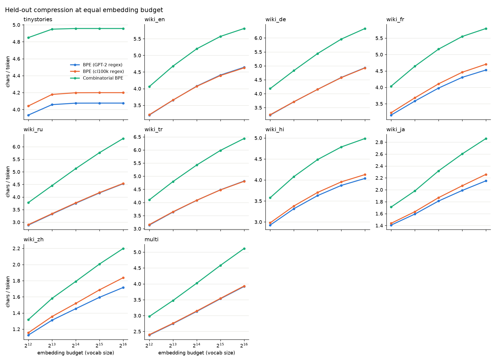
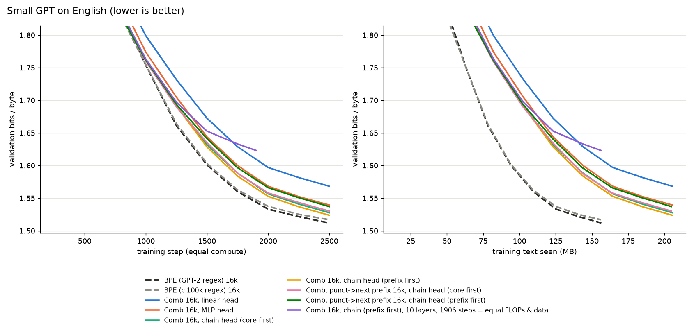
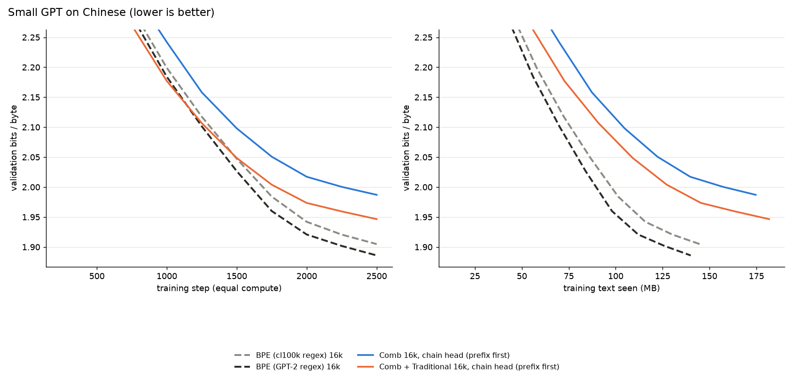
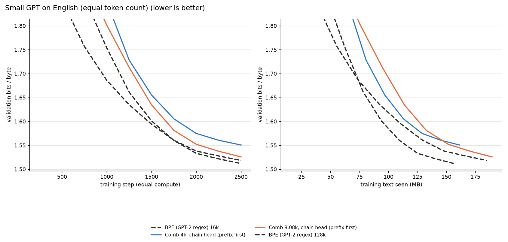
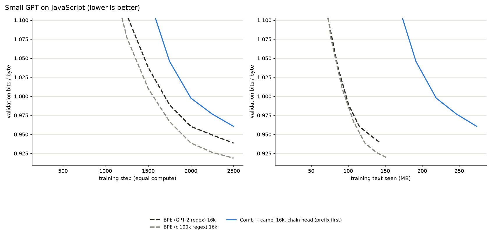

# Combinatorial BPE - results

## 1. Compression (characters per token on held-out text, higher is better)

Equal embedding budget: combinatorial `|var|+|prefix|+|core|+|suffix|` = baseline vocab size.

| corpus | vocab | BPE (GPT-2 regex) | BPE (cl100k regex) | HF tokenizers ByteLevel | Combinatorial BPE | Comb: no case | Comb: no affixes | gain vs best BPE |
|---|---:|---:|---:|---:|---:|---:|---:|---:|
| tinystories | 4096 | 3.934 | 4.042 | 3.940 | **4.849** | 4.803 | 2.267 | **+20.0%** |
| tinystories | 8192 | 4.058 | 4.178 | 4.058 | **4.949** | 4.937 | 2.289 | **+18.4%** |
| tinystories | 16384 | 4.075 | 4.198 | 4.075 | **4.957** | 4.954 | 2.290 | **+18.1%** |
| tinystories | 32768 | 4.076 | 4.199 | 4.076 | **4.957** | 4.954 | 2.290 | **+18.0%** |
| tinystories | 65536 | 4.076 | 4.199 | 4.076 | **4.957** | 4.954 | 2.290 | **+18.0%** |
| wiki_en | 4096 | 3.205 | 3.214 | 3.249 | **4.061** | 3.799 | 2.344 | **+26.3%** |
| wiki_en | 8192 | 3.653 | 3.657 | 3.672 | **4.678** | 4.414 | 2.535 | **+27.9%** |
| wiki_en | 16384 | 4.075 | 4.067 | 4.082 | **5.197** | 4.974 | 2.678 | **+27.5%** |
| wiki_en | 32768 | 4.408 | 4.393 | 4.409 | **5.570** | 5.404 | 2.774 | **+26.4%** |
| wiki_en | 65536 | 4.641 | 4.624 | 4.641 | **5.809** | 5.711 | 2.832 | **+25.2%** |
| wiki_de | 4096 | 3.233 | 3.245 | 3.267 | **4.183** | 3.834 | 2.540 | **+28.9%** |
| wiki_de | 8192 | 3.708 | 3.712 | 3.722 | **4.830** | 4.482 | 2.763 | **+30.1%** |
| wiki_de | 16384 | 4.155 | 4.155 | 4.161 | **5.441** | 5.107 | 2.951 | **+30.9%** |
| wiki_de | 32768 | 4.583 | 4.577 | 4.586 | **5.960** | 5.700 | 3.096 | **+30.0%** |
| wiki_de | 65536 | 4.933 | 4.924 | 4.934 | **6.340** | 6.166 | 3.196 | **+28.5%** |
| wiki_fr | 4096 | 3.155 | 3.227 | 3.193 | **4.035** | 3.827 | 2.355 | **+25.0%** |
| wiki_fr | 8192 | 3.581 | 3.681 | 3.598 | **4.642** | 4.426 | 2.547 | **+26.1%** |
| wiki_fr | 16384 | 3.978 | 4.107 | 3.984 | **5.164** | 4.978 | 2.696 | **+25.7%** |
| wiki_fr | 32768 | 4.305 | 4.461 | 4.308 | **5.551** | 5.419 | 2.796 | **+24.4%** |
| wiki_fr | 65536 | 4.529 | 4.704 | 4.532 | **5.794** | 5.713 | 2.857 | **+23.2%** |
| wiki_ru | 4096 | 2.884 | 2.901 | 2.901 | **3.778** | 3.565 | 2.389 | **+30.2%** |
| wiki_ru | 8192 | 3.323 | 3.339 | 3.326 | **4.455** | 4.207 | 2.639 | **+33.4%** |
| wiki_ru | 16384 | 3.751 | 3.767 | 3.751 | **5.129** | 4.852 | 2.861 | **+36.2%** |
| wiki_ru | 32768 | 4.162 | 4.175 | 4.161 | **5.761** | 5.509 | 3.046 | **+38.0%** |
| wiki_ru | 65536 | 4.527 | 4.539 | 4.525 | **6.324** | 6.098 | 3.196 | **+39.3%** |
| wiki_tr | 4096 | 3.137 | 3.155 | 3.188 | **4.098** | 3.822 | 2.501 | **+29.9%** |
| wiki_tr | 8192 | 3.634 | 3.644 | 3.654 | **4.796** | 4.518 | 2.742 | **+31.6%** |
| wiki_tr | 16384 | 4.079 | 4.083 | 4.087 | **5.424** | 5.159 | 2.935 | **+32.9%** |
| wiki_tr | 32768 | 4.481 | 4.476 | 4.484 | **5.982** | 5.748 | 3.090 | **+33.5%** |
| wiki_tr | 65536 | 4.814 | 4.805 | 4.816 | **6.436** | 6.258 | 3.207 | **+33.7%** |
| wiki_hi | 4096 | 2.926 | 2.980 | 1.510 | **3.578** | 3.564 | 2.080 | **+20.1%** |
| wiki_hi | 8192 | 3.316 | 3.381 | 1.523 | **4.081** | 4.062 | 2.239 | **+20.7%** |
| wiki_hi | 16384 | 3.628 | 3.703 | 1.530 | **4.486** | 4.464 | 2.354 | **+21.1%** |
| wiki_hi | 32768 | 3.871 | 3.955 | 1.535 | **4.787** | 4.766 | 2.434 | **+21.0%** |
| wiki_hi | 65536 | 4.037 | 4.129 | 1.538 | **4.987** | 4.969 | 2.485 | **+20.8%** |
| wiki_ja | 4096 | 1.407 | 1.437 | 1.404 | **1.710** | 1.695 | 1.448 | **+19.0%** |
| wiki_ja | 8192 | 1.592 | 1.632 | 1.607 | **1.981** | 1.966 | 1.636 | **+21.4%** |
| wiki_ja | 16384 | 1.811 | 1.868 | 1.800 | **2.317** | 2.303 | 1.854 | **+24.1%** |
| wiki_ja | 32768 | 1.989 | 2.068 | 1.978 | **2.603** | 2.598 | 2.032 | **+25.9%** |
| wiki_ja | 65536 | 2.150 | 2.258 | 2.142 | **2.861** | 2.870 | 2.184 | **+26.7%** |
| wiki_zh | 4096 | 1.126 | 1.156 | 1.173 | **1.318** | 1.310 | 1.146 | **+14.0%** |
| wiki_zh | 8192 | 1.311 | 1.356 | 1.328 | **1.581** | 1.574 | 1.333 | **+16.6%** |
| wiki_zh | 16384 | 1.453 | 1.519 | 1.467 | **1.791** | 1.781 | 1.478 | **+17.9%** |
| wiki_zh | 32768 | 1.594 | 1.686 | 1.597 | **2.006** | 1.998 | 1.619 | **+18.9%** |
| wiki_zh | 65536 | 1.716 | 1.837 | 1.720 | **2.198** | 2.192 | 1.741 | **+19.7%** |
| multi | 4096 | 2.385 | 2.398 | 2.224 | **2.972** | 2.822 | 1.974 | **+23.9%** |
| multi | 8192 | 2.746 | 2.758 | 2.474 | **3.475** | 3.290 | 2.182 | **+26.0%** |
| multi | 16384 | 3.131 | 3.143 | 2.723 | **4.020** | 3.810 | 2.383 | **+27.9%** |
| multi | 32768 | 3.530 | 3.541 | 2.968 | **4.580** | 4.363 | 2.568 | **+29.3%** |
| multi | 65536 | 3.917 | 3.932 | 3.187 | **5.112** | 4.903 | 2.727 | **+30.0%** |

Token-count reduction (tokens needed relative to best standard BPE):

| corpus | 4096 | 8192 | 16384 | 32768 | 65536 |
|---|---:|---:|---:|---:|---:|
| tinystories | -16.7% | -15.6% | -15.3% | -15.3% | -15.3% |
| wiki_en | -20.8% | -21.8% | -21.6% | -20.9% | -20.1% |
| wiki_de | -22.4% | -23.1% | -23.6% | -23.1% | -22.2% |
| wiki_fr | -20.0% | -20.7% | -20.5% | -19.6% | -18.8% |
| wiki_ru | -23.2% | -25.1% | -26.6% | -27.5% | -28.2% |
| wiki_tr | -23.0% | -24.0% | -24.7% | -25.1% | -25.2% |
| wiki_hi | -16.7% | -17.1% | -17.4% | -17.4% | -17.2% |
| wiki_ja | -16.0% | -17.6% | -19.4% | -20.5% | -21.1% |
| wiki_zh | -12.3% | -14.2% | -15.2% | -15.9% | -16.4% |
| multi | -19.3% | -20.7% | -21.8% | -22.7% | -23.1% |

### Learned budget split and factor usage (combinatorial)

| corpus | vocab | #prefix | #suffix | #core | tokens w/ prefix | w/ suffix | w/ case | distinct tuples used | baseline vocab that is a variant of another entry |
|---|---:|---:|---:|---:|---:|---:|---:|---:|---:|
| tinystories | 4096 | 12 | 22 | 4059 | 97% | 17% | 15% | 12925 | 12.6% |
| tinystories | 8192 | 21 | 39 | 8129 | 99% | 18% | 15% | 14843 | 16.7% |
| tinystories | 16384 | 21 | 39 | 12457 | 99% | 18% | 15% | 14873 | 25.0% |
| tinystories | 32768 | 21 | 39 | 12457 | 99% | 18% | 15% | 14873 | 26.2% |
| tinystories | 65536 | 21 | 39 | 12457 | 99% | 18% | 15% | 14873 | 26.2% |
| wiki_en | 4096 | 29 | 27 | 4037 | 64% | 10% | 14% | 32253 | 16.2% |
| wiki_en | 8192 | 53 | 48 | 8088 | 73% | 11% | 16% | 46246 | 18.4% |
| wiki_en | 16384 | 108 | 80 | 16193 | 81% | 13% | 18% | 60848 | 20.5% |
| wiki_en | 32768 | 219 | 141 | 32405 | 87% | 14% | 19% | 73287 | 24.0% |
| wiki_en | 65536 | 319 | 195 | 65019 | 91% | 14% | 20% | 79916 | 27.3% |
| wiki_de | 4096 | 30 | 27 | 4036 | 55% | 10% | 24% | 31037 | 20.0% |
| wiki_de | 8192 | 53 | 46 | 8090 | 64% | 11% | 27% | 45356 | 21.7% |
| wiki_de | 16384 | 114 | 70 | 16197 | 72% | 13% | 31% | 61548 | 23.9% |
| wiki_de | 32768 | 202 | 116 | 32447 | 79% | 14% | 34% | 77354 | 25.4% |
| wiki_de | 65536 | 347 | 181 | 65005 | 84% | 15% | 36% | 88533 | 26.2% |
| wiki_fr | 4096 | 53 | 19 | 4021 | 61% | 11% | 11% | 28229 | 17.7% |
| wiki_fr | 8192 | 94 | 40 | 8055 | 70% | 12% | 12% | 41083 | 19.0% |
| wiki_fr | 16384 | 170 | 70 | 16141 | 78% | 14% | 14% | 55684 | 20.4% |
| wiki_fr | 32768 | 365 | 115 | 32285 | 84% | 15% | 15% | 68865 | 23.0% |
| wiki_fr | 65536 | 599 | 156 | 64778 | 88% | 15% | 15% | 76439 | 25.7% |
| wiki_ru | 4096 | 39 | 30 | 4024 | 48% | 10% | 11% | 34345 | 17.9% |
| wiki_ru | 8192 | 68 | 44 | 8077 | 57% | 12% | 13% | 50433 | 17.7% |
| wiki_ru | 16384 | 123 | 67 | 16191 | 66% | 14% | 15% | 69280 | 18.2% |
| wiki_ru | 32768 | 192 | 113 | 32460 | 74% | 15% | 17% | 90545 | 19.3% |
| wiki_ru | 65536 | 354 | 185 | 64994 | 81% | 17% | 18% | 109303 | 20.8% |
| wiki_tr | 4096 | 29 | 26 | 4038 | 53% | 11% | 15% | 30031 | 16.5% |
| wiki_tr | 8192 | 54 | 49 | 8086 | 62% | 13% | 17% | 43025 | 19.0% |
| wiki_tr | 16384 | 105 | 72 | 16204 | 70% | 15% | 19% | 58179 | 19.8% |
| wiki_tr | 32768 | 177 | 126 | 32462 | 77% | 17% | 21% | 75655 | 20.7% |
| wiki_tr | 65536 | 321 | 202 | 65010 | 83% | 18% | 23% | 91106 | 21.6% |
| wiki_hi | 4096 | 40 | 36 | 4017 | 64% | 8% | 1% | 28963 | 37.1% |
| wiki_hi | 8192 | 81 | 56 | 8052 | 74% | 9% | 1% | 41598 | 37.5% |
| wiki_hi | 16384 | 165 | 92 | 16124 | 81% | 10% | 1% | 55506 | 38.4% |
| wiki_hi | 32768 | 318 | 161 | 32286 | 86% | 10% | 1% | 68829 | 40.0% |
| wiki_hi | 65536 | 501 | 241 | 64791 | 90% | 11% | 1% | 78416 | 41.6% |
| wiki_ja | 4096 | 22 | 54 | 4017 | 6% | 12% | 3% | 40798 | 5.9% |
| wiki_ja | 8192 | 44 | 95 | 8050 | 7% | 14% | 4% | 57937 | 7.5% |
| wiki_ja | 16384 | 90 | 176 | 16115 | 8% | 17% | 4% | 81737 | 12.4% |
| wiki_ja | 32768 | 155 | 293 | 32317 | 9% | 19% | 4% | 109326 | 17.0% |
| wiki_ja | 65536 | 281 | 462 | 64790 | 10% | 21% | 4% | 140779 | 20.5% |
| wiki_zh | 4096 | 22 | 69 | 4002 | 3% | 12% | 1% | 43644 | 6.2% |
| wiki_zh | 8192 | 40 | 100 | 8049 | 4% | 15% | 2% | 61007 | 6.3% |
| wiki_zh | 16384 | 73 | 187 | 16121 | 5% | 17% | 2% | 82403 | 9.1% |
| wiki_zh | 32768 | 155 | 342 | 32268 | 5% | 19% | 2% | 111724 | 13.8% |
| wiki_zh | 65536 | 272 | 530 | 64731 | 6% | 20% | 2% | 145364 | 17.0% |
| multi | 4096 | 40 | 31 | 4022 | 44% | 7% | 9% | 33360 | 25.2% |
| multi | 8192 | 66 | 48 | 8075 | 51% | 9% | 11% | 48856 | 24.6% |
| multi | 16384 | 110 | 73 | 16198 | 59% | 10% | 12% | 67682 | 24.3% |
| multi | 32768 | 203 | 115 | 32447 | 67% | 11% | 14% | 89963 | 24.5% |
| multi | 65536 | 370 | 195 | 64968 | 75% | 13% | 15% | 112207 | 25.0% |

### Chinese: Traditional/Simplified as a hand-coded variation

wiki_zh mixes both scripts (~45% of convertible characters are Traditional). `comb + Trad` stores cores in Simplified and adds a 4th variation, *Traditional* (OpenCC tables, exact round-trip only).

| vocab | BPE (GPT-2) | BPE (cl100k) | Comb | Comb + Trad | gain of Trad | tokens using Trad | vocab entries that are a script twin: cl100k / comb / comb + Trad |
|---:|---:|---:|---:|---:|---:|---:|---|
| 4096 | 1.126 | 1.156 | 1.318 | **1.431** | +8.6% | 14% | 16.5% / 16.9% / 0.0% |
| 8192 | 1.311 | 1.356 | 1.581 | **1.655** | +4.7% | 17% | 18.1% / 18.6% / 0.0% |
| 16384 | 1.453 | 1.519 | 1.791 | **1.884** | +5.2% | 18% | 17.6% / 18.2% / 0.0% |
| 32768 | 1.594 | 1.686 | 2.006 | **2.094** | +4.4% | 20% | 17.1% / 17.9% / 0.0% |
| 65536 | 1.716 | 1.837 | 2.198 | **2.286** | +4.0% | 21% | 16.6% / 17.4% / 0.0% |

### Source code (codeparrot/github-code-clean, train/test split by repository)

`Comb + camel` splits identifiers at case changes (`getUserName` -> `get|User|Name`). *fallback* = share of identifier characters that needed per-character encoding because a core piece had mixed case.

| corpus | vocab | BPE (GPT-2) | BPE (cl100k) | Comb | fallback | **Comb + camel** | gain vs best BPE | #prefix / #suffix |
|---|---:|---:|---:|---:|---:|---:|---:|---|
| code_python | 4096 | 3.046 | 3.147 | 5.259 | 1.3% | **5.453** | +73% | 190 / 186 |
| code_python | 8192 | 3.338 | 3.519 | 5.767 | 1.8% | **6.101** | +73% | 492 / 423 |
| code_python | 16384 | 3.533 | 3.801 | 5.982 | 2.5% | **6.455** | +70% | 1116 / 900 |
| code_python | 32768 | 3.654 | 4.007 | 6.049 | 3.1% | **6.653** | +66% | 1427 / 1104 |
| code_python | 65536 | 3.730 | 4.143 | 6.038 | 3.7% | **6.754** | +63% | 1427 / 1104 |
| code_java | 4096 | 3.291 | 3.475 | 4.837 | 5.8% | **5.799** | +67% | 233 / 116 |
| code_java | 8192 | 3.628 | 3.891 | 4.791 | 9.4% | **6.413** | +65% | 557 / 268 |
| code_java | 16384 | 3.855 | 4.189 | 4.540 | 13.0% | **6.758** | +61% | 1375 / 576 |
| code_java | 32768 | 3.996 | 4.393 | 4.307 | 16.2% | **6.914** | +57% | 1375 / 576 |
| code_java | 65536 | 4.096 | 4.544 | 4.127 | 18.5% | **6.976** | +54% | 1375 / 576 |
| code_javascript | 4096 | 3.019 | 3.105 | 5.115 | 3.0% | **5.547** | +79% | 294 / 176 |
| code_javascript | 8192 | 3.299 | 3.458 | 5.449 | 5.1% | **6.321** | +83% | 820 / 447 |
| code_javascript | 16384 | 3.474 | 3.701 | 5.498 | 7.1% | **6.758** | +83% | 2001 / 956 |
| code_javascript | 32768 | 3.579 | 3.873 | 5.361 | 9.0% | **6.961** | +80% | 2001 / 1240 |
| code_javascript | 65536 | 3.643 | 3.976 | 5.136 | 11.4% | **7.041** | +77% | 2001 / 1240 |
| code_cpp | 4096 | 2.801 | 2.931 | 4.977 | 2.0% | **5.279** | +80% | 267 / 159 |
| code_cpp | 8192 | 3.073 | 3.272 | 5.234 | 3.9% | **5.883** | +80% | 704 / 341 |
| code_cpp | 16384 | 3.266 | 3.524 | 5.104 | 6.5% | **6.212** | +76% | 1802 / 649 |
| code_cpp | 32768 | 3.390 | 3.710 | 4.944 | 8.9% | **6.389** | +72% | 2001 / 791 |
| code_cpp | 65536 | 3.472 | 3.848 | 4.767 | 11.0% | **6.473** | +68% | 2001 / 791 |
| code_go | 4096 | 2.656 | 2.898 | 4.439 | 4.9% | **5.193** | +79% | 273 / 158 |
| code_go | 8192 | 2.876 | 3.213 | 4.400 | 8.4% | **5.640** | +76% | 675 / 344 |
| code_go | 16384 | 3.006 | 3.429 | 4.260 | 11.2% | **5.871** | +71% | 912 / 463 |
| code_go | 32768 | 3.086 | 3.575 | 4.134 | 13.1% | **5.963** | +67% | 912 / 463 |
| code_go | 65536 | 3.135 | 3.676 | 3.997 | 15.1% | **5.963** | +62% | 912 / 463 |

Production reference, GPT-4's `cl100k_base` (100k vocab): python 4.19, java 4.57, javascript 4.03, cpp 3.86, go 3.59 chars/token.

## Language modelling: English (same 8-layer GPT, 2500 steps x 16k tokens)

| run | params | bytes/token | val bits-per-byte (equal compute) | at equal bytes seen* | bpb parts: case / prefix / core / suffix |
|---|---:|---:|---:|---:|---|
| BPE (GPT-2 regex) 16k | 33.8M | 3.82 | **1.5119** | 1.5121 | - |
| BPE (cl100k regex) 16k | 33.8M | 3.81 | **1.5169** | 1.5169 | - |
| Comb 16k, linear head | 34.1M | 5.01 | **1.5682** | 1.6097 | 0.033 / 0.052 / 1.379 / 0.105 |
| Comb 16k, MLP head | 34.6M | 5.01 | **1.5394** | 1.5809 | 0.025 / 0.046 / 1.371 / 0.098 |
| Comb 16k, chain head (core first) | 36.2M | 5.01 | **1.5277** | 1.5693 | 0.020 / 0.045 / 1.369 / 0.093 |
| Comb 16k, chain head (prefix first) | 36.2M | 5.01 | **1.5238** | 1.5651 | 0.020 / 0.072 / 1.339 / 0.093 |
| Comb, punct->next prefix 16k, chain head (core first) | 36.2M | 5.00 | **1.5302** | 1.5693 | 0.020 / 0.105 / 1.405 / 0.000 |
| Comb, punct->next prefix 16k, chain head (prefix first) | 36.2M | 5.00 | **1.5371** | 1.5776 | 0.020 / 0.165 / 1.352 / 0.000 |
| Comb 16k, chain (prefix first), 10 layers, 1906 steps = equal FLOPs & data | 42.5M | 5.01 | **1.6228** | 1.6232 | 0.021 / 0.079 / 1.426 / 0.097 |

\* learning curve interpolated at 156M training bytes (what the standard BPE saw), i.e. equal data instead of equal compute. Caveat: the combinatorial runs are mid-schedule (learning rate not yet decayed) at that point, which exaggerates their gap.

## Language modelling: Chinese (same 8-layer GPT, 2500 steps x 16k tokens)

| run | params | bytes/token | val bits-per-byte (equal compute) | at equal bytes seen* | bpb parts: case / prefix / core / suffix |
|---|---:|---:|---:|---:|---|
| BPE (cl100k regex) 16k | 33.8M | 3.53 | **1.9048** | 1.9100 | - |
| BPE (GPT-2 regex) 16k | 33.8M | 3.42 | **1.8859** | 1.8859 | - |
| Comb 16k, chain head (prefix first) | 36.2M | 4.26 | **1.9870** | 2.0169 | 0.003 / 0.039 / 1.791 / 0.154 |
| Comb + Traditional 16k, chain head (prefix first) | 36.2M | 4.44 | **1.9465** | 1.9826 | 0.023 / 0.038 / 1.734 / 0.151 |

\* learning curve interpolated at 140M training bytes (what the standard BPE saw), i.e. equal data instead of equal compute. Caveat: the combinatorial runs are mid-schedule (learning rate not yet decayed) at that point, which exaggerates their gap.

## Language modelling: English (equal token count) (same 8-layer GPT, 2500 steps x 16k tokens)

| run | params | bytes/token | val bits-per-byte (equal compute) | at equal bytes seen* | bpb parts: case / prefix / core / suffix |
|---|---:|---:|---:|---:|---|
| BPE (GPT-2 regex) 16k | 33.8M | 3.82 | **1.5119** | 1.5119 | - |
| Comb 4k, chain head (prefix first) | 29.9M | 3.94 | **1.5506** | 1.5536 | 0.027 / 0.084 / 1.342 / 0.098 |
| Comb 9.08k, chain head (prefix first) | 32.6M | 4.62 | **1.5257** | 1.5483 | 0.022 / 0.075 / 1.334 / 0.095 |
| BPE (GPT-2 regex) 128k | 92.6M | 4.52 | **1.5184** | 1.5333 | - |

\* learning curve interpolated at 156M training bytes (what the standard BPE saw), i.e. equal data instead of equal compute. Caveat: the combinatorial runs are mid-schedule (learning rate not yet decayed) at that point, which exaggerates their gap.

## Language modelling: JavaScript (same 8-layer GPT, 2500 steps x 16k tokens)

| run | params | bytes/token | val bits-per-byte (equal compute) | at equal bytes seen* | bpb parts: case / prefix / core / suffix |
|---|---:|---:|---:|---:|---|
| BPE (GPT-2 regex) 16k | 33.8M | 3.51 | **0.9385** | 0.9385 | - |
| BPE (cl100k regex) 16k | 33.8M | 3.74 | **0.9188** | 0.9235 | - |
| Comb + camel 16k, chain head (prefix first) | 36.2M | 6.68 | **0.9605** | 1.2232 | 0.017 / 0.128 / 0.678 / 0.138 |

\* learning curve interpolated at 144M training bytes (what the standard BPE saw), i.e. equal data instead of equal compute. Caveat: the combinatorial runs are mid-schedule (learning rate not yet decayed) at that point, which exaggerates their gap.

